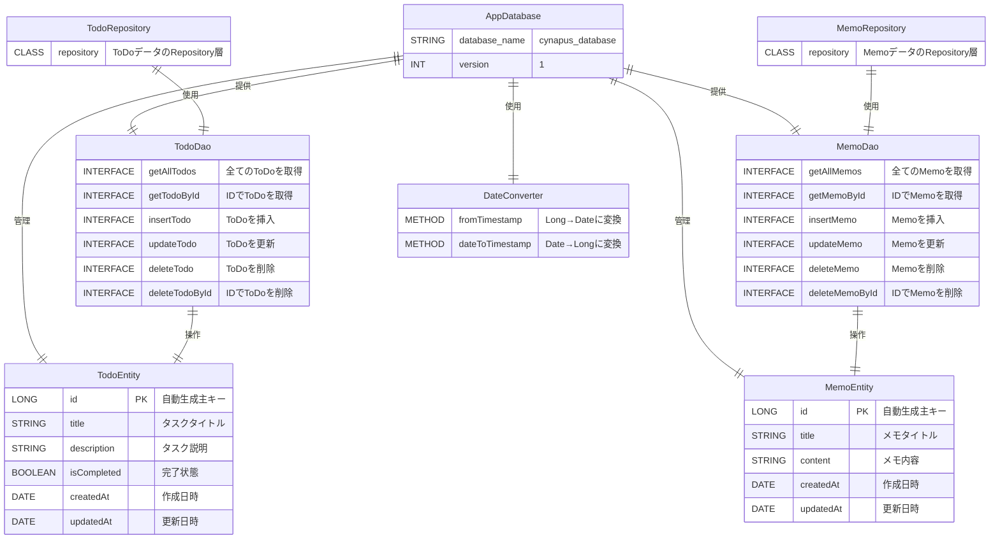

# Cynapus - Entity Relationship Diagram (E-R図)

## データベース構造

CynapusアプリケーションのデータベースはRoomライブラリを使用してSQLiteデータベースとして実装されています。

## E-R図

## エンティティ詳細

### TodoEntity（ToDoテーブル）

| カラム名 | データ型 | 制約 | 説明 |
|----------|----------|------|------|
| id | LONG | PRIMARY KEY, AUTO_INCREMENT | 一意識別子 |
| title | STRING | NOT NULL | タスクのタイトル |
| description | STRING | NOT NULL | タスクの詳細説明 |
| isCompleted | BOOLEAN | NOT NULL, DEFAULT FALSE | 完了状態フラグ |
| createdAt | DATE | NOT NULL | 作成日時 |
| updatedAt | DATE | NOT NULL | 最終更新日時 |

### MemoEntity（Memoテーブル）

| カラム名 | データ型 | 制約 | 説明 |
|----------|----------|------|------|
| id | LONG | PRIMARY KEY, AUTO_INCREMENT | 一意識別子 |
| title | STRING | NOT NULL | メモのタイトル |
| content | STRING | NOT NULL | メモの内容 |
| createdAt | DATE | NOT NULL | 作成日時 |
| updatedAt | DATE | NOT NULL | 最終更新日時 |

## データアクセス層

### DAO（Data Access Object）パターン

- **TodoDao**: ToDoエンティティに対するCRUD操作を提供
- **MemoDao**: Memoエンティティに対するCRUD操作を提供

### Repository パターン

- **TodoRepository**: ToDoデータの業務ロジックを抽象化
- **MemoRepository**: Memoデータの業務ロジックを抽象化

## データベース設計の特徴

### 1. 型安全性
- Room Databaseによるコンパイル時の型チェック
- KotlinのNull安全性を活用

### 2. 日時管理
- DateConverterによるDate型とLong型の自動変換
- 作成・更新日時の自動追跡

### 3. LiveData統合
- DAOメソッドがLiveDataを返すことで反応型UI更新を実現
- ViewModelとの効率的な連携

### 4. トランザクション安全
- Roomによる自動トランザクション管理
- データ整合性の保証

## インデックス戦略

現在のバージョンでは基本的なインデックス設計：
- PRIMARY KEYによる自動インデックス（id列）
- 将来の拡張でタイトル検索用インデックスを検討

## マイグレーション

バージョン1.0での初期設計のため、マイグレーション戦略は今後の版数アップ時に実装予定。

---

*この E-R図は Room Database の論理設計を表しています。物理的なSQLiteテーブル構造はRoomが自動生成します。*