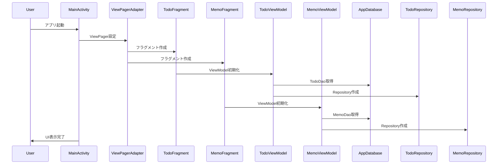
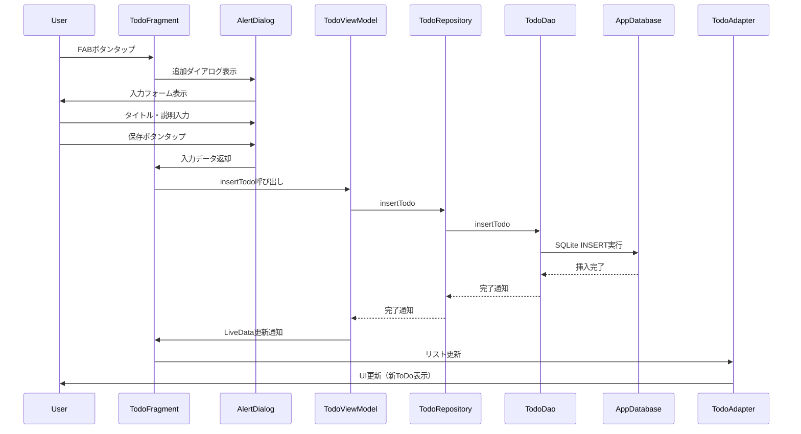
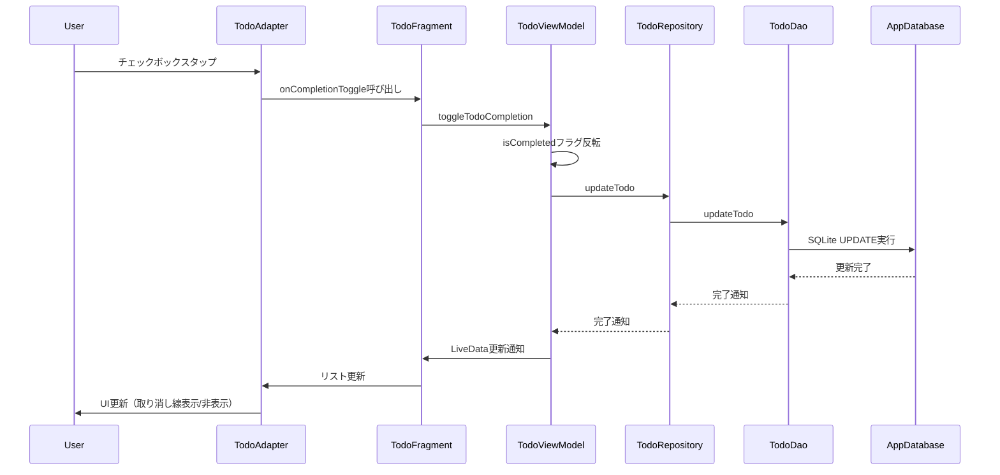
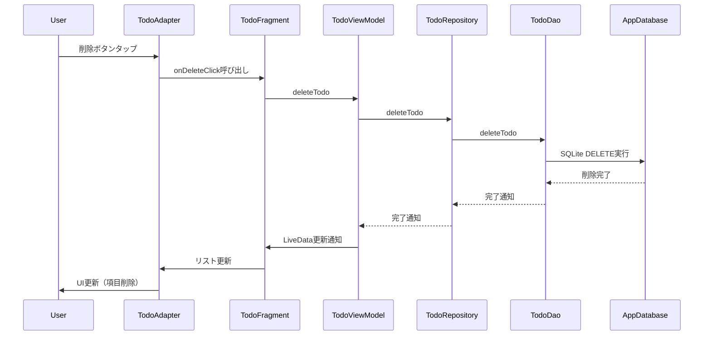
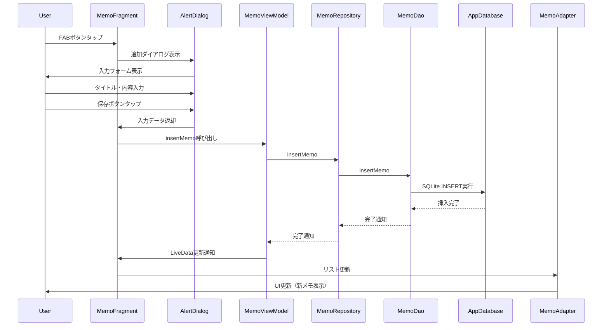
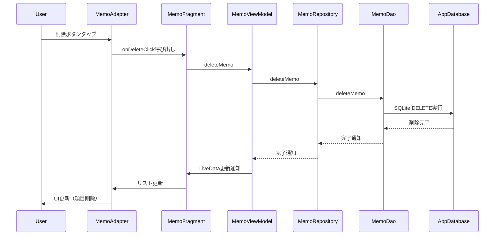
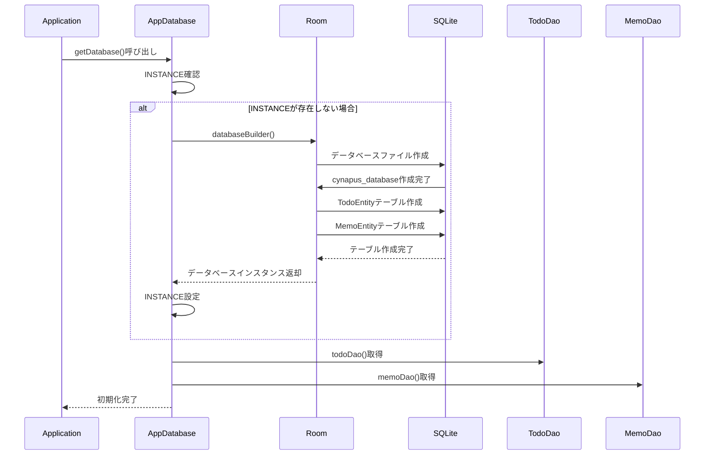
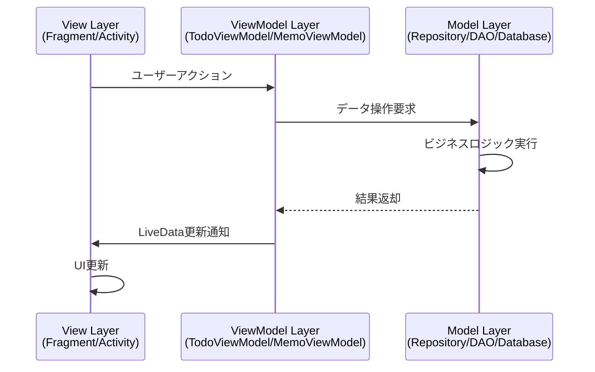
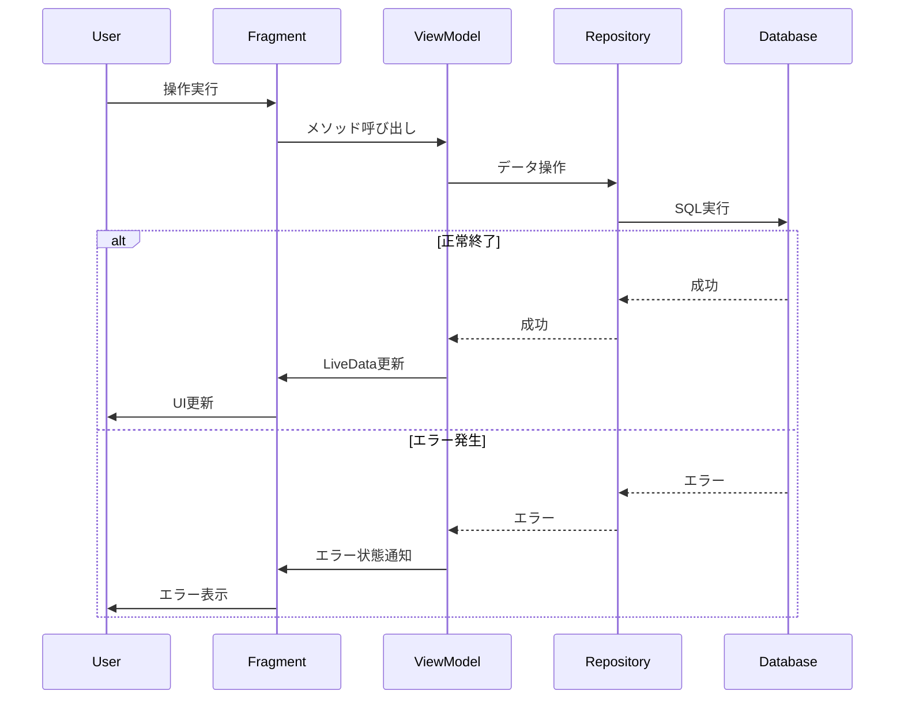

# Cynapus - Sequence Diagrams (シーケンス図)

## アプリケーションフロー

Cynapusアプリケーションのメイン機能について、シーケンス図で処理の流れを示します。

## 1. アプリケーション起動フロー

## 2. ToDo作成フロー

## 3. ToDo完了切り替えフロー

## 4. ToDo削除フロー

## 5. メモ作成フロー

## 6. メモ削除フロー

## 7. データベース初期化フロー

## アーキテクチャパターン

### MVVM (Model-View-ViewModel) パターン

## エラーハンドリングフロー

---

*これらのシーケンス図は、Cynapusアプリケーションの主要な処理フローを視覚化したものです。MVVMアーキテクチャパターンとRoom Databaseの活用により、保守性の高い設計となっています。*